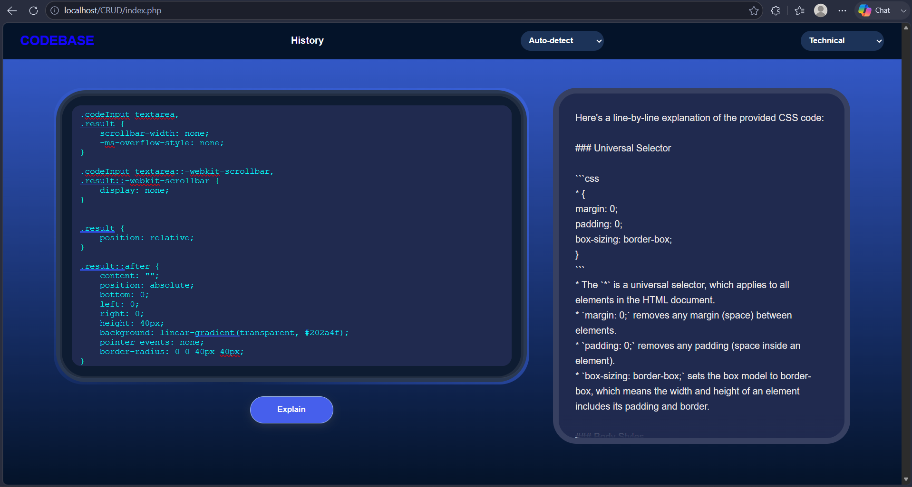

CODEBASE 
AI-powered code explainer that turns confusing code into plain English.
Paste any code snippet and get a clear, structured explanation, built for students and developers who want to understand code, not just copy it.
 Features
   Explains code in any language, line by line
   Powered by Groq's llama-3.3-70b-versatile for fast, high-quality responses
   Clean dark navy & gold interface
   Secure API key handling via .env
   MySQL-backed history (optional persistence of past explanations)
 Tech Stack
  Layer
  Technology
  Backend
  PHP
  AI
  Groq API (Llama 3.3 70B)
  Database
  MySQL (via phpMyAdmin)
  Frontend
  HTML/CSS/JS
Getting Started
 Prerequisites
  PHP 8+ and MySQL (e.g. via XAMPP)
  A free Groq API key
  Setup
  Bash
  Create a .env file in the project root:
  Code
  Import the database schema via phpMyAdmin (see /database/schema.sql)
  Start your local server (e.g. XAMPP) and navigate to the project folder
  Open in browser and paste in some code to try it out
Preview
 

How It Works
 User pastes code into the input box
 PHP backend sends the snippet to the Groq API with a structured prompt
 Groq's LLM returns an explanation, parsed from choices[0]["message"]["content"]
 Explanation is rendered in the UI, optionally saved to MySQL
License
 MIT — free to use and adapt.
 Built by Gbeklui Etornam, Level 200 BIT student, Ghana Communication Technology University.
